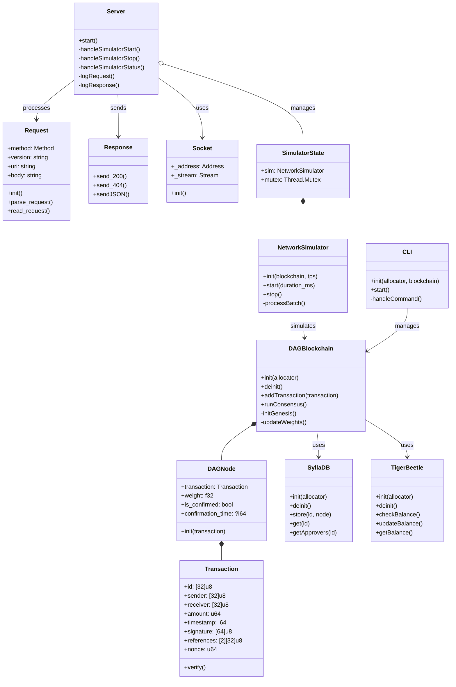

# DAG Blockchain

# UML Schema of the DAG Blockchain


## Build and Run

Build and run the blockchain simulation:
```bash
zig build run
```

Run tests:
```bash
zig build test
```

## CLI Usage

Start the interactive CLI:
```bash
zig build cli
```

### Available Commands

1. Send tokens:
```bash
send <sender_hex> <receiver_hex> <amount>
```

2. Check account balance:
```bash
balance <address_hex>
```

3. Get transaction details:
```bash
tx <transaction_id_hex>
```

4. List all transactions:
```bash
list
```

5. Show help:
```bash
help
```

6. Exit CLI:
```bash
exit
```

### Example Usage

```bash
# Send 100 tokens
> send 000102030405060708090a0b0c0d0e0f101112131415161718191a1b1c1d1e1f 202122232425262728292a2b2c2d2e2f303132333435363738393a3b3c3d3e3f 100

# Check balance
> balance 000102030405060708090a0b0c0d0e0f101112131415161718191a1b1c1d1e1f

# View transaction details
> tx a1b2c3d4e5f6...

# List all transactions
> list
```

Note: All addresses and transaction IDs should be in hexadecimal format.