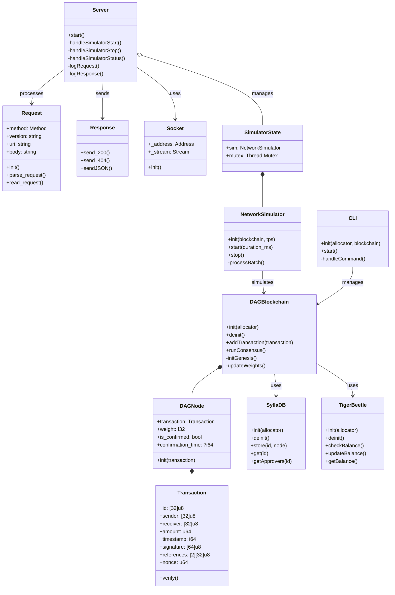

# DAG Blockchain for IoT Systems

A directed acyclic graph (DAG) based blockchain implementation specifically designed for IoT networks, featuring high throughput, low latency, and scalable consensus mechanisms.

## UML Schema of the DAG Blockchain



## Overview

This project implements a DAG-based blockchain system optimized for IoT environments, providing:

- Fast transaction processing with DAG architecture
- Lightweight consensus mechanism suitable for IoT devices
- High throughput simulation capabilities
- Built-in balance management and transaction verification
- HTTP API for remote management
- CLI interface for local control

## Architecture

The system consists of several key components:

### Core Components

1. **DAG Blockchain**
   - Implements a directed acyclic graph structure for transaction management
   - Provides fast and efficient transaction validation
   - Supports parallel transaction processing
   - Uses weight-based consensus mechanism

2. **Storage Layer**
   - SyllaDB: Efficient DAG node storage and retrieval
   - TigerBeetle: High-performance account balance management

3. **Network Layer**
   - HTTP server for remote management
   - Supports RESTful API endpoints
   - Thread-safe simulator state management

### IoT-Specific Features

- Lightweight consensus mechanism suitable for resource-constrained devices
- Fast transaction confirmation times
- Scalable architecture supporting many concurrent IoT nodes
- Low computational requirements for participation

## API Endpoints

```
GET /status - Check simulator status
POST /start - Start simulation with parameters
POST /stop - Stop running simulation
GET / - API information
```

### Example API Usage

Start simulation:
```bash
curl -X POST http://localhost:3490/start \
  -H "Content-Type: application/json" \
  -d '{"tps": 1000, "duration_ms": 60000}'
```

Check status:
```bash
curl http://localhost:3490/status
```

## CLI Commands

```
send <sender> <receiver> <amount>  - Send tokens
balance <address>                  - Get account balance
tx <id>                           - Get transaction details
list                              - List all transactions
help                              - Show help message
exit                              - Exit the CLI
```

## Installation

### Prerequisites

- Zig compiler (latest version)
- 64-bit operating system
- Minimum 4GB RAM recommended

### Build Instructions

```bash
# Clone the repository
git clone [https://github.com/spreadzp/DAG-blockchain.git]

# Build the project
zig build

# Run the server
./zig-out/bin/blockchain-server

# Run the CLI
./zig-out/bin/blockchain-cli
```

## IoT Use Cases

### Device Authentication
- Each IoT device can have its own blockchain address
- Transactions can be used to verify device authenticity
- Provides immutable record of device interactions

### Data Integrity
- Sensor data can be stored as transactions
- DAG structure ensures data immutability
- Weight-based consensus provides fast validation

### Resource Management
- Track resource usage across IoT network
- Manage device permissions and access rights
- Monitor network health and performance

### Event Logging
- Immutable audit trail of device events
- Trackable sensor data history
- Secure logging of system changes

## Performance Characteristics

- Transaction Processing: Up to 1000 TPS
- Average Confirmation Time: < 5 seconds
- Scalable to thousands of IoT nodes
- Low resource requirements for node operation

## Security Features

- Transaction signing for authenticity
- Weight-based consensus for attack resistance
- Immutable transaction history
- Double-spending protection

## Simulation Capabilities

The system includes a network simulator for testing and performance analysis:
- Configurable TPS (Transactions Per Second)
- Customizable simulation duration
- Real-time performance monitoring
- Detailed statistics collection

## Development Status

This project is currently in active development. Key features implemented:
- [x] Core DAG blockchain functionality
- [x] Basic consensus mechanism
- [x] CLI interface
- [x] HTTP API
- [x] Network simulator
- [ ] Advanced security features
- [ ] Production-ready storage implementation
- [ ] Full IoT device integration

## Contributing

Contributions are welcome! Please read our contributing guidelines and code of conduct before submitting pull requests.

## License

[Add your license information here]